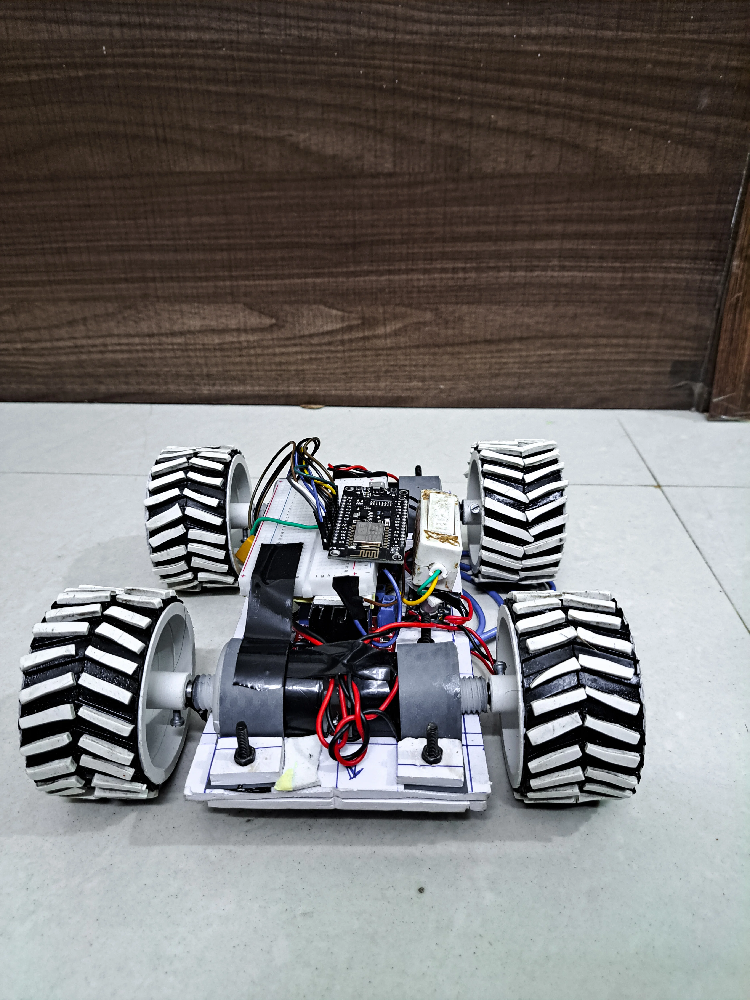
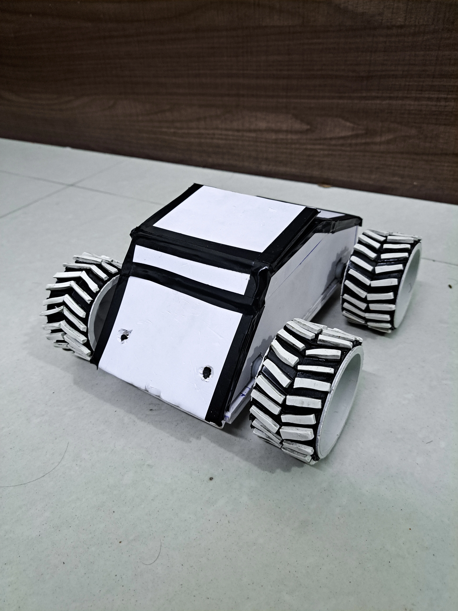
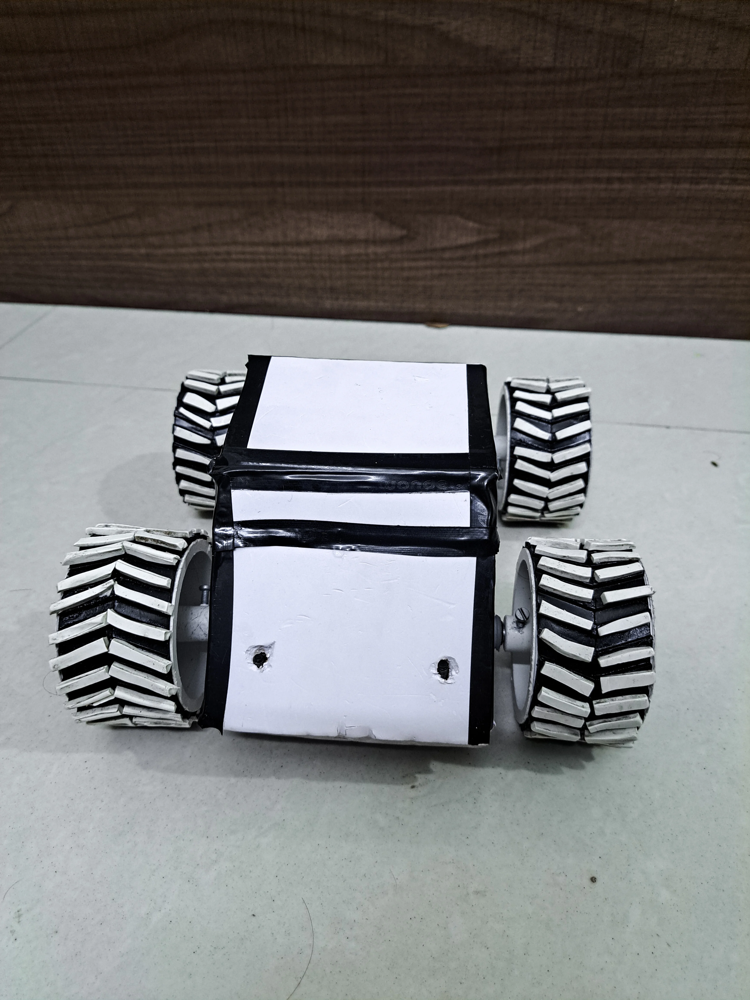
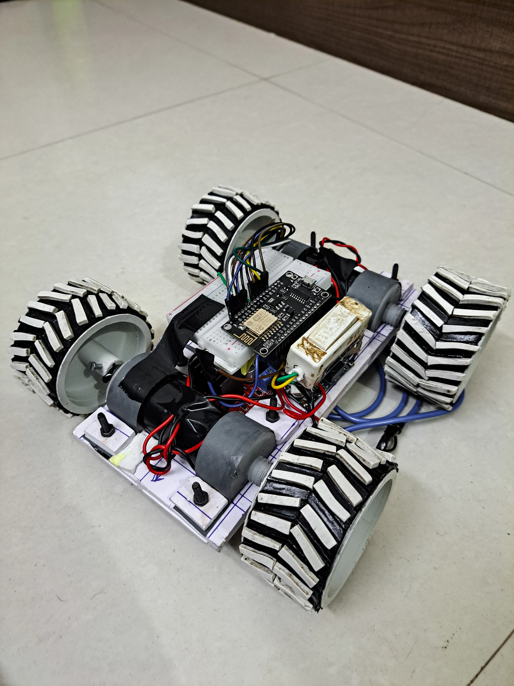

<h1 align="center"> 🤖 Gesture Control </h1>



Gesture Control is a versatile Python application that enables real-time control of a robot using hand gestures or keyboard inputs. It offers an intuitive interface for users to interact with the robot effortlessly.

## Libraries Used

<div align="center">

[](#)  [](#)  [](#)  [](#)  [](#)  [](#) [](#)  [](#) [](#) 
</div>

## What does the Bot Do?

Bot Control empowers users to control a robot's movements and actions through two primary methods:

1. **Hand Gesture Control:** Utilizing the webcam, the application detects and interprets hand gestures, translating them into commands for the robot. Users can navigate the robot's movements seamlessly by gesturing in front of the camera.

2. **Keyboard Control:** Alternatively, users can control the robot using keyboard inputs. This method offers precise control over the robot's actions, allowing users to issue specific commands with ease.

3. **Voice Control** `(Work In progress)` Bot Control also offers voice control functionality, allowing users to control the robot using spoken commands. By leveraging automatic speech recognition (ASR) technology, users can issue commands to the robot simply by speaking into a microphone.

## Key Features

- **Real-time Control:** Experience immediate responsiveness as you control the robot's movements and actions in real-time.
- **Intuitive Interface:** Choose between hand gesture or keyboard control based on your preference or convenience, with a user-friendly interface guiding you through the process.
- **Versatile Application:** Suitable for various robot applications, including remote-controlled vehicles, robotic arms, and more.
- **Voice Control:** Control the robot using natural language commands, thanks to built-in automatic speech recognition capabilities.

## How it Works

Bot Control relies on the following components and technologies:

- **Python Programming:** The application is built using Python, a versatile and powerful programming language known for its simplicity and readability.
- **OpenCV Library:** OpenCV is used for computer vision tasks, enabling the detection and recognition of hand gestures from the webcam feed.
- **Keyboard Library:** The keyboard library facilitates keyboard input monitoring, allowing users to control the robot using key presses.
- **ESP8266 WebSocket Server:** The robot communicates with the application via a WebSocket server hosted on an ESP8266 microcontroller, enabling seamless interaction between the user and the robot.
- **Voice Control** The Robot utilizes automatic speech recognition (ASR) technology to enable voice control functionality. The voice module records audio input from a microphone, which is then processed by the ASR model to transcribe spoken commands into text. The transcribed commands are then interpreted and translated into corresponding robot actions.

## Photos





## Getting Started

To get started with Bot Control, follow these steps:

1. **Clone the Repository:** Clone the repository to your local machine using Git:

```bash
git clone https://github.com/R0h1th-1DD4E2/Gesture-Control.git
```

2. **Install Dependencies:** Install the required Python libraries by running:

```bash
pip install -r requirements.txt
```
3. **Setup:** Store your `Groq` api key in an `.env` file.

4. **Run the Application:** Launch the application by executing the main Python script:

```bash
python controller.py
```
The above command can also be given with an argument consisting of IP of the bot, only if the bot is connected to the other network other than your laptop's hotspot.

5. **Choose Control Mode:** Follow the on-screen instructions to select your preferred control mode (hand gesture or keyboard control) and start controlling the robot.

6. **Voice Control:** Run `voiceController.py` with or without the the IP of the the bot as argument to cnnect the bot and control it.